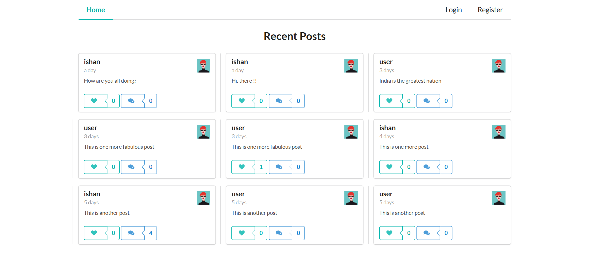
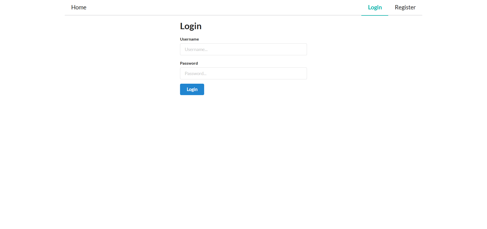
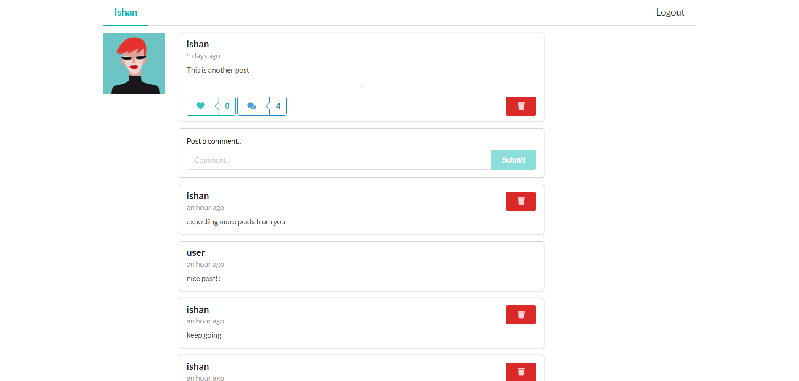
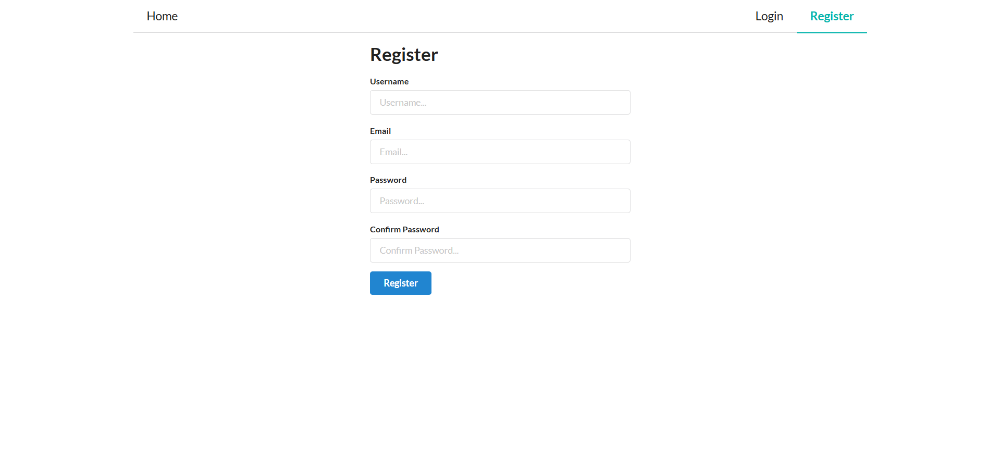

# PostSphere-Social Media App

This project is a full-stack **GraphQL-powered social media application** built using the **MERN stack (MongoDB, Express, React, Node.js)** with **Apollo Client** for handling GraphQL on the frontend.

---

## 🚀 Features

- User registration and login with JWT-based authentication
- Create, delete, and like posts
- Add and delete comments on posts
- Real-time updates using Apollo cache
- Semantic UI for sleek styling
- Protected routes for authenticated users

---

## 🛠️ Tech Stack

**Frontend:**

- React
- Apollo Client
- Semantic UI React
- GraphQL

**Backend:**

- Node.js
- Express
- Apollo Server
- MongoDB
- Mongoose
- JSON Web Tokens (JWT)
- bcryptjs

---

## 📸 Screenshots

| Home Page | Login Page |
|-----------|------------|
|  |  |

| Post View | Register Page |
|-----------|---------------|
|  |  |
